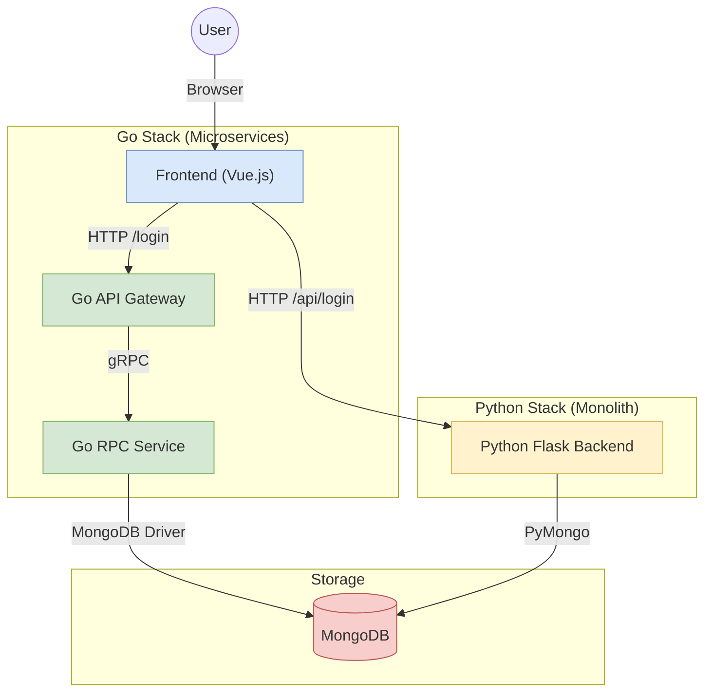
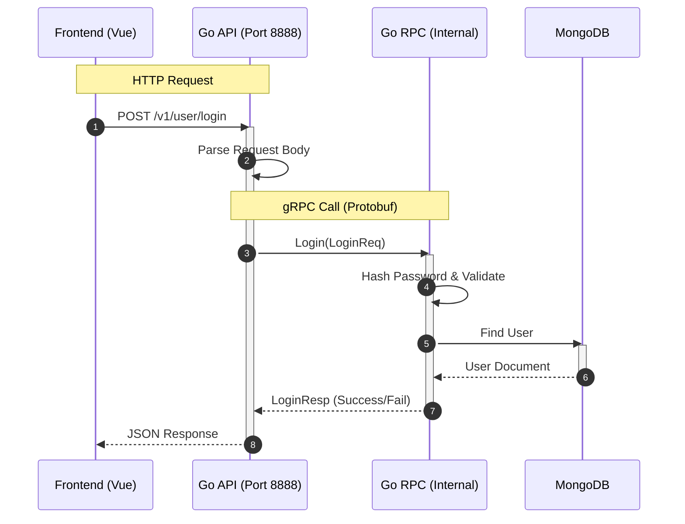
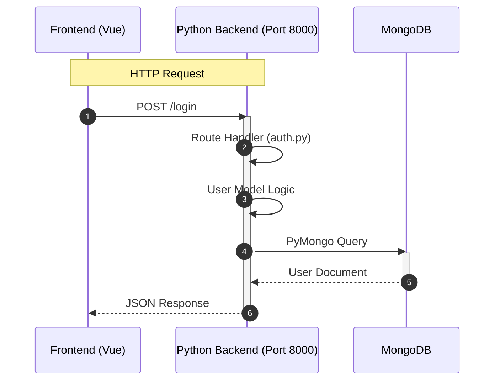
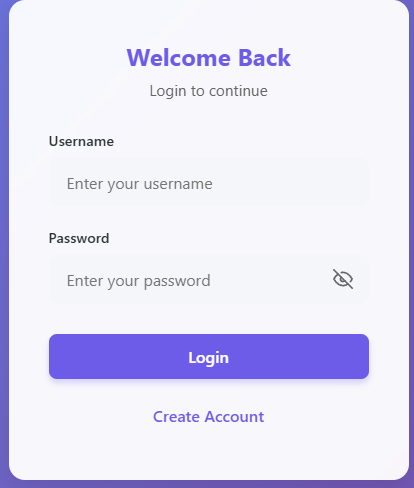
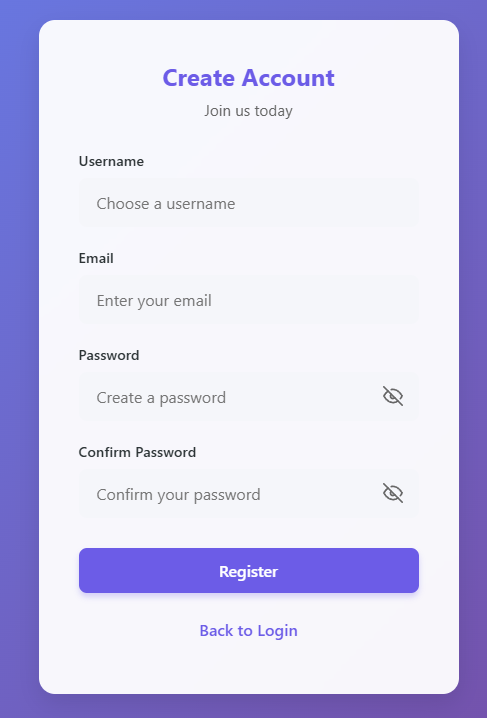
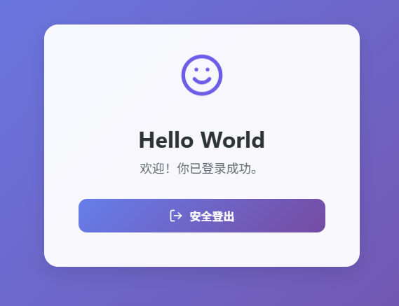
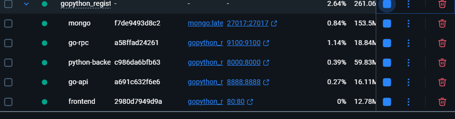

# GoPython Register Logon System

这是一个全栈演示项目，展示了如何构建一个包含多种后端技术栈（Go 和 Python）以及现代前端（Vue.js）的注册登录系统。项目采用微服务架构思想，使用 Docker Compose 进行一键编排和部署。

## 🌟 项目亮点

*   **多语言后端**：同时提供了 Go (go-zero 框架) 和 Python (Flask 框架) 的后端实现。
*   **微服务架构**：Go 后端拆分为 API Gateway 和 RPC Service，展示了 gRPC 通信模式。
*   **统一数据存储**：不同后端服务共享同一个 MongoDB 数据库。
*   **容器化部署**：完整的 Docker 支持，环境一致性有保障。

## 🛠️ 技术栈

*   **Frontend**: Vue.js 3, Vite
*   **Go Backend**: Golang 1.24, go-zero (API & RPC), gRPC
*   **Python Backend**: Python 3.9, Flask, PyMongo
*   **Database**: MongoDB
*   **DevOps**: Docker, Docker Compose

## 🚀 快速开始

### 前置要求

确保本地已安装：
*   [Docker](https://www.docker.com/products/docker-desktop)
*   [Docker Compose](https://docs.docker.com/compose/install/)

### 启动项目

1.  克隆项目到本地。
2.  在项目根目录下运行以下命令构建并启动所有服务：

    ```bash
    docker-compose up -d --build
    ```

3.  等待容器启动完成后，访问前端页面：
    *   **URL**: `http://localhost`

### 服务端口说明

| 服务 | 容器内端口 | 主机映射端口 | 说明 |
| :--- | :--- | :--- | :--- |
| **Frontend** | 80 | 80 | 用户访问入口 |
| **Go API Gateway** | 8888 | 8888 | Go HTTP 接口 |
| **Go RPC Service** | 9100 | 9100 | Go 内部 RPC 服务 |
| **Python Backend** | 8000 | 8000 | Python HTTP 接口 |
| **MongoDB** | 27017 | 27017 | 数据库 |

## 📊 数据处理流程 (Mermaid)

以下流程图展示了系统中各组件的数据流转逻辑。

### 1. 系统整体架构



### 2. Go 后端详细处理流程

Go 后端采用 API Gateway + RPC Service 的模式。API 层负责参数解析，RPC 层负责核心业务逻辑。



### 3. Python 后端详细处理流程

Python 后端采用传统的单体 Flask 应用模式。




## 运行效果
### 首页：

### 登录页：

### 注册页：

### 登录成功：


## dockers部署：
